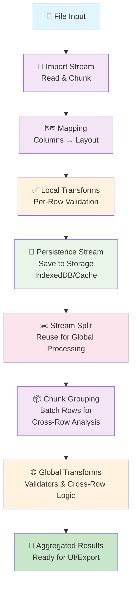

# ETL CoreStream

[](https://www.npmjs.com/package/etl-corestream)
[](https://bundlephobia.com/package/etl-corestream)
[](LICENSE)

A headless, framework-agnostic ETL orchestrator library for efficiently processing massive datasets with millions of rows and gigabytes of data without blocking the UI. Built with streams, pipelines, workers, and async patterns to handle enterprise-scale data transformations.

## 🚀 Features

### Core Capabilities

- **Headless Architecture**: Framework-agnostic library compatible with React, Angular, Vue, and any Node.js ecosystem framework
- **Stream-Based Processing**: Built on RxJS and Node.js Streams for memory-efficient handling of massive files
- **Non-Blocking**: Processes tens of gigabytes of data without freezing the user interface
- **State Machine Orchestration**: Powered by XState for reliable, predictable data pipeline management
- **Client-Side Validation & Transformation**: Validate and transform heavy documents on the client before sending to backend

### Advanced Features

- **Dynamic Validators**: Configure custom validators at runtime
- **Async Transformations**: Apply async transformations and validations against your backend
- **Lightweight Results**: Generate pre-processed data streams that are ready to consume, reducing backend load
- **Bi-directional Validation**: Client-side validation and transformation without sacrificing backend validation security
- **Row-Level Operations**: Edit, remove, or modify individual rows with seamless state management
- **Export Flexibility**: Stream results directly to external APIs or download as files
- **Comprehensive Logging**: Track progress, metrics, and errors throughout the pipeline
- **Persistence Layer**: Automatic data persistence between operations
- **Pagination Support**: Handle large result sets with built-in pagination

## 🎯 Why CoreStream?

Compare traditional approaches with CoreStream:

| Approach | Flow | Result |
|----------|------|--------|
| Traditional | File - RAM (Load All) | Crash on large datasets |
| Old Streaming | File - Memory Chunks | Still blocks UI |
| CoreStream | File - Stream - Worker (UI Smooth) - IndexedDB - API | Processes GB seamlessly |

CoreStream solves the core problem: **process massive files without sacrificing UI responsiveness**.

With CoreStream, you can:
- [x] Handle files larger than available RAM
- [x] Keep your UI responsive during import
- [x] Validate and transform on the client
- [x] Stream results to backend APIs
- [x] Track progress in real-time

## 📦 Installation

```bash
npm install etl-corestream
# or
yarn add etl-corestream
# or
pnpm add etl-corestream
```

## 🎯 Quick Start

### Minimal Setup (30 seconds)

```typescript
import { OrchestatorModule, ProviderModule } from 'etl-corestream';

const orchestrator = new OrchestatorModule();
orchestrator.initialize(new ProviderModule(), 'session-001');

// Subscribe to state changes
orchestrator.state$.subscribe(state => {
  console.log('Pipeline state:', state);
});

// Subscribe to progress
orchestrator.metrics$.subscribe(metrics => {
  console.log(`${metrics.processedRows}/${metrics.totalRows} rows processed`);
});

// Select file and go!
orchestrator.selectFile(userFile);
```

### Minimal Example: File Upload with Layout

Here's a complete minimal example that uploads a file, applies a layout, and gets results:

```typescript
import { OrchestatorModule, ProviderModule, LayoutBase } from 'etl-corestream';

// 1. Define a simple layout
const contactsLayout: LayoutBase = {
  columns: [
    { key: 'name', label: 'Contact Name', type: 'string' },
    { key: 'email', label: 'Email', type: 'email' },
    { key: 'phone', label: 'Phone', type: 'string' }
  ],
  validators: {
    local: [],
    global: []
  },
  transforms: {
    local: [],
    global: []
  }
};

// 2. Initialize orchestrator
const provider = new ProviderModule();
const orchestrator = new OrchestatorModule();
orchestrator.initialize(provider, 'contacts-import');

// 3. Apply layout
orchestrator.selectLayout(contactsLayout);

// 4. Monitor progress
orchestrator.metrics$.subscribe(metrics => {
  console.log(`Progress: ${metrics.processedRows}/${metrics.totalRows}`);
  console.log(`Errors: ${metrics.errorCount}`);
});

// 5. Listen for ready state
orchestrator.state$.subscribe(state => {
  if (state === 'waiting-user') {
    console.log('✅ Data loaded and ready!');
    // Now you can interact with rows or export
  }
});

// 6. Select file (e.g., from HTML input)
const fileInput = document.getElementById('fileInput') as HTMLInputElement;
fileInput.addEventListener('change', (e) => {
  const file = e.target.files?.[0];
  if (file) {
    orchestrator.selectFile(file);
  }
});

// 7. Export results when ready
// orchestrator.export('your-export-id', 'Stream');
```

For a complete step-by-step guide including layouts, validators, and transforms, see [How to Implement](./docs/how-to-implement.md).

### Fluent Configuration (Advanced)

If you need more control, the API is built for composition:

```typescript
const orchestrator = new OrchestatorModule()
  .initialize(new ProviderModule(), 'session-001');

orchestrator.state$.subscribe(state => updateUI(state));
orchestrator.metrics$.subscribe(m => console.log(`${m.percentage}%`));

// Your pipeline is ready to process files
orchestrator.selectFile(file);
```

### Pipeline Flow

The orchestrator follows a deterministic state machine, ensuring predictable and reliable data processing:

```
┌─────────────────────────────────────────────────────────────┐
│                  ETL CoreStream Pipeline                    │
└─────────────────────────────────────────────────────────────┘

  initializing
       │
       ▼
  waiting-layout ◄────── (Select Layout)
       │
       ▼
  waiting-file ◄────────── (Select File)
       │
       ▼
  importing ────────────── (Read file stream)
       │                    ⏱️ Non-blocking
       ▼
  mapping ────────────────── (Map columns to layout)
       │
       ▼
  handling-local-step ────── (Apply row-level validators/transforms)
       │
       ▼
  persisting ────────────── (Save to IndexedDB/Storage)
       │
       ▼
  handle-global-steps ────── (Apply cross-row validators/transforms)
       │
       ▼
  initializing-user-view ─── (Load rows for UI)
       │
       ▼
  waiting-user ◄─────────── (Ready for user interactions)
       │
       ├─► editRow()
       ├─► removeRow()
       └─► export()
```

**Key Transitions:**
- **importing → mapping**: File parsed and ready for column mapping
- **mapping → handling-local-step**: Layout applied, validators queued
- **handle-global-steps → waiting-user**: All validations complete, data ready

## 🏗️ Architecture

### Modular Design

ETL CoreStream is built around a modular architecture with a central orchestrator managing multiple specialized engines:

- **Orchestrator**: State machine coordinating the entire ETL pipeline
- **Provider Module**: Dependency injection container for all services
- **Logger Module**: Comprehensive logging and event tracking
- **Storage Layer**: Persistent data management between pipeline stages
- **Validation Engines**: Local and global validation frameworks
- **Transform Engines**: Data transformation pipelines
- **Import/Export Handlers**: File I/O and stream management

### Stream-Based Architecture

The pipeline uses a dual-stream approach optimized for memory efficiency and scalability:



**Key Pipeline Stages:**

1. **File Input** → Reads file content
2. **Import Stream** → Chunks data to avoid memory overload
3. **Mapping** → Maps columns to layout structure
4. **Local Transforms** → Per-row validation and transformation (fast, synchronous)
5. **Persistence** → Saves intermediate results to storage
6. **Stream Split** → Reuses stream for global processing (reduces redundant reads)
7. **Chunk Grouping** → Groups rows in batches for efficient cross-row validation
8. **Global Transforms** → Cross-row validators, aggregations, async validation
9. **Aggregated Results** → Final data ready for UI or export

This dual-stream approach ensures:
- ✅ Constant memory usage (never loads entire file)
- ✅ Non-blocking UI (chunks processed asynchronously)
- ✅ Efficient global validation (batched, not per-row)
- ✅ Reduced backend load (pre-processed data)

## 💡 Core Concepts

### State Machine Management

The orchestrator uses XState's powerful state machine to ensure reliable state transitions and predictable behavior throughout the data pipeline.

### Reactive Updates

Built on RxJS Observables and Preact Signals for efficient, reactive state management. Subscribe to any aspect of the pipeline:

```typescript
orchestrator.state$.subscribe(state => { /* ... */ });
orchestrator.context$.subscribe(context => { /* ... */ });
orchestrator.metrics$.subscribe(metrics => { /* ... */ });
orchestrator.logs$.subscribe(log => { /* ... */ });
```

### Memory Efficiency

Stream-based processing means you're never loading entire datasets into memory. Data flows through pipelines in chunks, enabling processing of files that exceed available RAM.

### Headless Design

CoreStream provides only the functions, not the UI. This allows you to:

- Build custom UIs for any framework
- Integrate with existing UI libraries
- Maintain complete control over presentation
- Reuse the same backend logic across multiple frontend frameworks

## 📚 Documentation

Comprehensive guides for all use cases:

### Getting Started
- [How to Implement](./docs/how-to-implement.md) - Complete implementation guide
- [How to Create Layouts](./docs/how-to-create-layouts.md) - Define data structures

### Validation & Transformation
- [How to Create Custom Local Validators and Transforms](./docs/how-to-create-custom-local-validator-and-transforms.md) - Per-row validation
- [How to Create Custom Global Validators and Transforms](./docs/how-to-create-custom-global-validator-and-transforms.md) - Cross-row validation
- [How to Use Global Async Validators](./docs/how-to-use-global-async-validators.md) - Backend-connected validation

### Data Operations
- [How to Use Edit Rows](./docs/how-to-use-edit-rows.md) - Modify individual rows
- [How to Use Importers](./docs/how-to-use-importers.md) - Handle different file formats
- [How to Track Logs and Progress](./docs/how-to-track-logs-and-progress.md) - Monitor pipeline progress

### Export & Integration
- [How to Create Export Function](./docs/how-to-create-export-fn.md) - Define export handlers
- [How to Consume Export Stream to External API](./docs/how-to-consume-export-stream-to-external-api.md) - Stream to backend services

## 🔧 Usage Examples

### Complete Pipeline Example

```typescript
import { OrchestatorModule, ProviderModule, LayoutBase } from 'etl-corestream';

async function processBulkImport() {
  // 1. Initialize
  const provider = new ProviderModule();
  const orchestrator = new OrchestatorModule();
  orchestrator.initialize(provider, 'bulk-import-session');

  // 2. Define layout
  const layout: LayoutBase = {
    columns: [
      { key: 'name', label: 'Name', type: 'string' },
      { key: 'email', label: 'Email', type: 'email' },
      { key: 'age', label: 'Age', type: 'number' }
    ],
    validators: {
      local: [
        // per-row validators
      ],
      global: [
        // cross-row validators
      ]
    },
    transforms: {
      local: [
        // per-row transforms
      ],
      global: [
        // cross-row transforms
      ]
    }
  };

  orchestrator.selectLayout(layout);

  // 3. Monitor progress
  orchestrator.metrics$.subscribe(metrics => {
    console.log(`Processed: ${metrics.processedRows}/${metrics.totalRows}`);
    console.log(`Errors: ${metrics.errorCount}`);
  });

  // 4. Select file
  const file = await getUserFileSelection();
  orchestrator.selectFile(file);

  // 5. Wait for ready state
  const readyState = new Promise(resolve => {
    orchestrator.state$.subscribe(state => {
      if (state === 'waiting-user') {
        resolve(true);
      }
    });
  });

  await readyState;

  // 6. Handle user interactions
  orchestrator.editRow('row-123', 'email', 'newemail@example.com');
  orchestrator.removeRow('row-456');

  // 7. Export processed data
  orchestrator.export('api-stream', 'Stream');

  // 8. Cleanup
  orchestrator.stop();
}
```

### With React

```typescript
import { useEffect, useState } from 'react';
import { OrchestatorModule } from 'etl-corestream';

export function DataImporter() {
  const [orchestrator] = useState(() => new OrchestatorModule());
  const [state, setState] = useState('initializing');
  const [metrics, setMetrics] = useState({ totalRows: 0, processedRows: 0, errorCount: 0 });

  useEffect(() => {
    orchestrator.state$.subscribe(setState);
    orchestrator.metrics$.subscribe(setMetrics);

    return () => orchestrator.stop();
  }, []);

  const handleFileSelect = (file: File) => {
    orchestrator.selectFile(file);
  };

  return (
    <div>
      <input type="file" onChange={(e) => handleFileSelect(e.target.files[0])} />
      <p>State: {state}</p>
      <p>Progress: {metrics.processedRows}/{metrics.totalRows}</p>
      <p>Errors: {metrics.errorCount}</p>
    </div>
  );
}
```

### With Angular

```typescript
import { Component, OnInit, OnDestroy } from '@angular/core';
import { OrchestatorModule } from 'etl-corestream';
import { Subject } from 'rxjs';
import { takeUntil } from 'rxjs/operators';

@Component({
  selector: 'app-data-importer',
  template: `
    <div>
      <input type="file" (change)="onFileSelect($event)" />
      <p>State: {{ state }}</p>
      <p>Progress: {{ metrics.processedRows }}/{{ metrics.totalRows }}</p>
    </div>
  `
})
export class DataImporterComponent implements OnInit, OnDestroy {
  orchestrator = new OrchestatorModule();
  state = 'initializing';
  metrics = { totalRows: 0, processedRows: 0, errorCount: 0 };
  
  private destroy$ = new Subject<void>();

  ngOnInit() {
    this.orchestrator.state$
      .pipe(takeUntil(this.destroy$))
      .subscribe(state => this.state = state);

    this.orchestrator.metrics$
      .pipe(takeUntil(this.destroy$))
      .subscribe(metrics => this.metrics = metrics);
  }

  onFileSelect(event: Event) {
    const file = (event.target as HTMLInputElement).files?.[0];
    if (file) {
      this.orchestrator.selectFile(file);
    }
  }

  ngOnDestroy() {
    this.destroy$.next();
    this.destroy$.complete();
    this.orchestrator.stop();
  }
}
```

## 🎓 Key Concepts

### Non-Blocking Processing

All heavy operations run in streams and workers, ensuring the UI thread never blocks:

```typescript
// This won't freeze the UI, even with millions of rows
orchestrator.selectFile(hugeFile); // Still responsive!
```

### Client-Side Validation

Validate and transform data on the client before sending to the backend. The library maintains validation context, allowing you to:

1. Validate locally with fast, synchronous rules
2. Apply async validation against backend APIs
3. Transform data based on validation results
4. Send pre-processed, validated data

### Stream-First Export

Export doesn't load data into memory. Results flow as streams, making it easy to:

```typescript
// Stream directly to an API
orchestrator.export('backend-api', 'Stream');

// Or download as a file
orchestrator.export('csv-download', 'File');
```

## 🛠️ Technologies

- **XState**: State machine and actor pattern for orchestration
- **RxJS**: Reactive streams and observables
- **Preact Signals**: Lightweight, performant reactive signals
- **Node.js Streams**: Memory-efficient stream processing
- **TypeScript**: Full type safety and IDE support
- **Papa Parse**: CSV parsing capabilities

## 📋 Requirements

- **Node.js**: 16.x or higher
- **Browser Support**: All modern browsers supporting:
  - Web Streams API
  - ReadableStream
  - WebWorkers (for async operations)

## 🤝 Use Cases

- **Bulk Data Import**: Import CSV, Excel, or JSON files with millions of rows
- **ETL Pipelines**: Enterprise data transformation and loading
- **Data Validation**: Multi-stage validation framework for complex rules
- **Async Processing**: Long-running operations without blocking the UI
- **Report Generation**: Stream large reports without memory overhead
- **API Integration**: Seamless backend validation and transformation
- **Real-Time Monitoring**: Track progress of long-running operations

## 📊 Performance Characteristics

- **Memory**: Constant memory usage regardless of file size (stream-based)
- **Processing Speed**: Multi-megabyte per second throughput
- **UI Responsiveness**: Non-blocking, UI remains responsive during processing
- **Scalability**: Tested with files up to 50+ GB
- **Concurrency**: Multiple orchestrators can run independently

## 🔐 Security

- **No Data Transmission on Init**: Only send data when explicitly exporting
- **Backend Validation**: Client-side validation doesn't replace backend checks
- **Input Sanitization**: Built-in sanitization for common attack vectors
- **Stream Isolation**: Each pipeline operates independently with isolated state

## 📝 License

ISC

## 🤔 FAQ

### Q: Will CoreStream work with my UI framework?
**A:** Yes! CoreStream is headless and framework-agnostic. Use it with React, Angular, Vue, Svelte, or vanilla JavaScript.

### Q: How large can files be?
**A:** Limited only by available disk space. Stream-based processing means files can exceed available RAM.

### Q: Can I validate against my backend?
**A:** Yes! Use global async validators to integrate with your backend APIs during processing.

### Q: Does client-side validation replace backend validation?
**A:** No. Client-side validation improves UX and reduces server load, but backend validation is essential for security.

### Q: Can multiple files be processed simultaneously?
**A:** Yes! Create multiple orchestrator instances for parallel processing.

### Q: How do I handle row-level edits?
**A:** Use the `editRow()` method to modify specific fields, which triggers re-validation and updates state.

## 📞 Support

For issues, questions, or contributions:

- **Documentation**: See the [docs](./docs) folder for comprehensive guides
- **Examples**: Check documentation files for practical examples
- **Issues**: Report bugs through your project's issue tracker

## 🚀 Getting Started

1. **Install**: `npm install etl-corestream`
2. **Read**: [How to Implement](./docs/how-to-implement.md)
3. **Explore**: Check documentation files for your use case
4. **Build**: Create your first ETL pipeline!

---

**Built for enterprise-scale data processing without compromise.**
